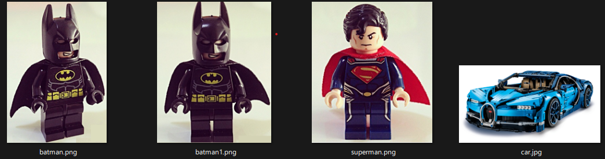

* this unordered seed list will be replaced by the toc
{:toc}

## 0. OpenCV’s compareHist
OpenCV에서는 두 히스토그램의 유사도를 계산하는 <code>compareHist</code> 함수를 제공하고 있습니다 [<a href='https://docs.opencv.org/4.7.0/d6/dc7/group__imgproc__hist.html#gaf4190090efa5c47cb367cf97a9a519bd'>1</a>].

> <code>cv2.compareHist(hist1, hist2, method)</code>
> - <code>hist1</code>: 첫 번째 비교 대상 histogram
> - <code>hist2</code>: 두 번째 비교 대상 histogram, **H1과 같은 크기여야 함**.
> - <code>method</code>: 비교 방법

1-, 2-, 3-dimensional dense histogram에서도 잘 동작합니다. 
⚠️ 그러나 high-dimensional sparse histogram에서는 부적절합니다. 이때는 EMD function 사용을 권장합니다.

 
## 1. Histogram Comparison Methods
OpenCV에서는 두 개의 histogram이 얼마나 일치하는지 표현할 수 있는 4가지 metrics을 제공하고 있습니다 [<a href='https://docs.opencv.org/4.7.0/d8/dc8/tutorial_histogram_comparison.html'>2</a>].

### <u>a. correlation (<code>cv2.HISTCMP_CORREL</code>)</u>
$$
\begin{aligned}
d(H_1, H_2) = \cfrac{\sum_{I}(H_1(I) - \bar{H}_1)(H_2(I) - \bar{H}_2)}{\sqrt{\sum_{I}(H_1(I)-\bar{H}_1)^2 \sum_{I}(H_2(I) - \bar{H}_2)^2}}
\end{aligned}$$

이 때, $$\bar{H_k} = \cfrac{1}{N}\sum_{J}H_k(J)$$, $$N$$은 총 histogram bin의 수입니다.

### <u>b. Chi-Square (<code>cv2.HISTCMP_CHISQR</code>)</u>
$$
\begin{aligned}
d(H_1, H_2) = \sum_I \cfrac{(H_1(I) - H_2(I))^2}{H_1(I)}
\end{aligned}$$

카이 제곱 통계랑은 데이터 분포와 가정된 분포 사이의 차이를 나타내는 측정값을 말합니다.

### <u>c. Intersection (<code>cv2.HISTCMP_INTERSECT</code>)</u>
$$
\begin{aligned}
d(H_1, H_2) = \sum_{I}min(H_1(I), H_2(I))
\end{aligned}$$

두 histogram이 겹치는 넓이를 계산합니다.

### <u>d. Bhattacharyya distance (<code>cv2.HISTCMP_BHATTACHARYYA</code>)</u>
$$
\begin{aligned}
d(H_1, H_2) = \sqrt{1 - \cfrac{1}{\sqrt{\bar{H_1}\bar{H_2}N^2}} \sum_I{\sqrt{H_1(I) \cdot H_2(I)}}}
\end{aligned}$$

바타차야 거리는 두 확률 분포의 유사성을 측정할 수 있습니다.
 

## 2. Code Example

||
|:--:|
|Fig 1. (a) 배트맨 레고 블록이 base image (b) 각도가 히스토그램의 유사성에 미치는 영향을 보기 위한 정면 배트맨 (c) 비슷한 형태이지만 다른 슈퍼맨 (d) 레고로 만든 부가티 [<a href='https://www.flickr.com/photos/126293860@N05/'>출처</a>]|

|Method|Base-Base|Base-Angle|Base-test|Base-test2|
|---|---|---|---|---|---|
|Correlation|1.0000|0.7717|0.7582|0.0190|
|Chi-square|0.0000|13.8087|728.8255|38.3160|
|Intersection|19.5277|11.2600|8.2892|0.3480|
|Bhattacharyya|0.0000|0.3117|0.5253|0.9013|

Correlation과 Intersection 방법을 사용할 경우, metric 값이 높을수록 일치할 확률이 높습니다. 같은 이미지끼리 비교한 Base-Base와 약간의 각도 차이만 있는 Base-Angle의 결과를 통해 이를 확인할 수 있습니다.

나머지 metrics의 경우, 값이 작을수록 좋은 결과를 의미합니다. base image와 거리가 먼 슈퍼맨과 부가티의 경우 수치가 큰 것을 확인할 수 있습니다.

이 함수를 응용하여 색상만으로 물체를 인식하는 간단한 classifier를 만들어볼 수 있습니다 [<a href='https://mpatacchiola.github.io/blog/2016/11/12/the-simplest-classifier-histogram-intersection.html'>3</a>].