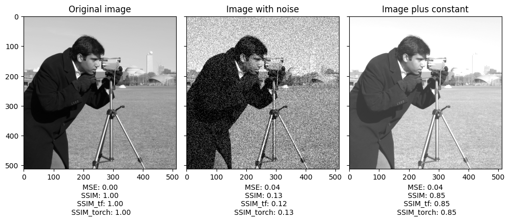

* this unordered seed list will be replaced by the toc
{:toc}

## SSIM (Structural Similarity Index Measure)
<div align="center">
$$
\text{SSIM}(x,y)=\left[l(x,y)^{\alpha }\cdot c(x,y)^{\beta }\cdot s(x,y)^{\gamma }\right]
$$
$$
l(x,y)={\frac {2\mu _{x}\mu _{y}+c_{1}}{\mu _{x}^{2}+\mu _{y}^{2}+c_{1}}} \\ c(x,y)={\frac {2\sigma _{x}\sigma _{y}+c_{2}}{\sigma _{x}^{2}+\sigma _{y}^{2}+c_{2}}}\\s(x,y)={\frac {\sigma _{xy}+c_{3}}{\sigma _{x}\sigma _{y}+c_{3}}}
$$
</div>
- SSIM은 두 이미지의 유사도를 luminance, contrast, structure 3가지 요소를 이용하여 비교합니다.
- $$\alpha$$, $$\beta$$, $$\gamma$$는 각 요소의 중요도를 나타내는 hyperparameter입니다.
- triangle inequality를 만족하지 않기 때문에 distance는 아닙니다.
<hr>

## SSIM Implementation
### Pytorch Implementation [<a href='https://gaussian37.github.io/vision-concept-ssim/'>1</a>, <a href='https://medium.com/srm-mic/all-about-structural-similarity-index-ssim-theory-code-in-pytorch-6551b455541e#091f'>2</a>]

#### 가우시안 윈도우 생성
gaussian distribution $$f(x) = \frac{1}{\sigma\sqrt{2\pi}}
  \exp\left( -\frac{1}{2}\left(\frac{x-\mu}{\sigma}\right)^{\!2}\,\right)$$을 이용하여 window size만큼의 1D 가우시안 윈도우를 생성합니다.<br>이때 생성한 가우시안 윈도우는 합이 1이 되도록 normalize합니다.

```python
def gaussian(window_size, sigma):
    g = torch.Tensor([math.exp(-(x - window_size//2)**2 / float(2*sigma**2)) for x in range(window_size)])
    return g / g.sum()

>>>
gaussian(11, 2.5)
tensor([0.0222, 0.0456, 0.0798, 0.1191, 0.1514, 0.1640, 0.1514, 0.1191, 0.0798,
        0.0456, 0.0222])
```

#### 2D 가우시안 kernel 생성
1D gaussian distribution을 cross product하여 (N, N) 크기의 2D로 만듭니다. 이후 channel 수만큼 확장합니다.

```python
def create_2d_gaussian(window_size, channel=1):
    # _1d.size() -> (window_size, 1)
    _1d = gaussian(window_size=window_size, sigma=1.5).unsqueeze(1)

    # create 2d by _1d (window_size, 1) @ _1d.T (1, window_size)
    # torch.mm: matrix multiplication, no broadcasting
    # final output: (1, 1, window_size, window_size)
    _2d = _1d.mm(_1d.t()).float().unsqueeze(0).unsqueeze(0)

    # F.conv2d weight: (out_channels, in_channels/groups, kernel_size[0], kernel_size[1])
    out = torch.Tensor(_2d.expand(channel, 1, window_size, window_size).contiguous())
    return out
```

#### SSIM 계산
논문의 저자는 image quality 평가 측면에서 볼 때, global하게 연산하는 것보다 이미지 영역을 $$N \times N$$ 윈도우로 분할하고, 각 윈도우에 대해 SSIM을 측정할 것을 권장합니다. 효율을 위해 저자는 11x11 circular-symmetric Gaussian Weighing function을 사용했습니다.<br>이는 이미지의 통계적 특성이 공간적으로 non-stationary하기 때문입니다. 또한, 이미지의 왜곡은 local하게 발생할 수 있으며 사람의 시각은 한 번에 한 지점만 고해상도로 인식할 수 있기 때문에 local한 SSIM을 계산하는 것이 더욱 의미가 있습니다 [<a href='https://ieeexplore.ieee.org/document/1284395'>3</a>].

```python
def ssim(img1, img2, win_size=11, data_range=255, window=None):

    # L: the dynamic range of the pixel values
    L = data_range

    _, channels, height, width = img1.size()
    if window is None:
        min_window = min(win_size, height, width)
        window = create_2d_gaussian(min_window, channel=channels).to(img1.device)

    # calculate the luminance componenet
    pad = win_size // 2
    mu1 = F.conv2d(img1, window, padding=pad, groups=channels)
    mu2 = F.conv2d(img2, window, padding=pad, groups=channels)

    mu1_sq = mu1 ** 2
    mu2_sq = mu2 ** 2
    mu12 = mu1 * mu2

    # calculate the contrast component
    sigma1_sq = F.conv2d(img1 * img1, window, padding=pad, groups=channels) - mu1_sq
    sigma2_sq = F.conv2d(img2 * img2, window, padding=pad, groups=channels) - mu2_sq
    sigma12 =  F.conv2d(img1 * img2, window, padding=pad, groups=channels) - mu12

    # constants
    C1 = (0.01 * L) ** 2
    C2 = (0.03 * L) ** 2

    numerator1 = 2 * mu12 + C1
    numerator2 = 2 * sigma12 + C2
    denominator1 = mu1_sq + mu2_sq + C1
    denominator2 = sigma1_sq + sigma2_sq + C2

    ssim_score = (numerator1 * numerator2) / (denominator1 * denominator2)

    ret = ssim_score.mean()
    return ret
```
### Tensorflow Implementation [<a href='https://www.tensorflow.org/api_docs/python/tf/image/ssim'>4</a>]
```python
tf.image.ssim(
    img1,
    img2,
    max_val,
    filter_size=11,
    filter_sigma=1.5,
    k1=0.01,
    k2=0.03,
    return_index_map=False
)
```

### scikit-image Implementation [<a href='https://scikit-image.org/docs/dev/api/skimage.metrics.html#skimage.metrics.structural_similarity'>5</a>]
```python
from skimage.metrics import structural_similarity as ssim

ssim(
    im1,
    im2,
    *,
    win_size=None,
    gradient=False,
    data_range=None,
    channel_axis=None,
    gaussian_weights=False,
    full=False,
    **kwargs)
```

<hr>
## SSIM loss
SSIM은 미분 가능하고 0 -1 사이의 값을 가지기 때문에 1에서 뺀 형태로 만들어 loss term으로 사용할 수 있습니다.
<div align="center">
$$L_{\text{SSIM}} = 1 - \text{SSIM}(x, y)$$
</div>

최근에는 여러 변형된 SSIM loss가 제안됐습니다. MS-SSIM은 SSIM에 scale space의 개념을 추가한 것입니다 [<a href='https://github.com/jorge-pessoa/pytorch-msssim'>65</a>].<br>또한 MS-SSIM과 L1-loss를 합친 mix loss로 image restoration을 진행했을 때 성능이 좋았다는 연구 결과도 있습니다 [<a href='https://ieeexplore.ieee.org/document/7797130'>7</a>]
<hr>

## Test code

||
|:--:|
|Fig 1. MSE, SSIM(scikit-image), SSIM(tensorflow), SSIM(pytorch) 결과 비교|

서로 다른 라이브러리로 계산하여도 동일한 결과가 나온 것을 확인할 수 있습니다.